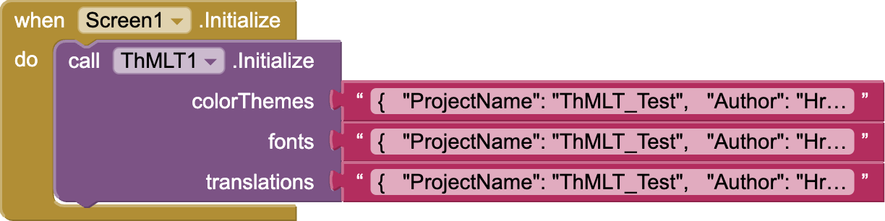
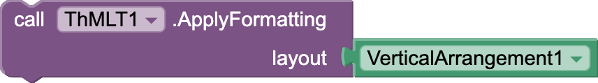

<div align="center">
<h1><kbd>🧩 ThMLT</kbd></h1>
</div>

## 📝 Specifications


ThMLT (Theme & Multilanguage Translation) is an advanced extension for [App Inventor 2 (AI2)](http://ai2.appinventor.mit.edu) that streamlines theme management (colors & fonts) and enables seamless multilanguage support across your AI2 project.

---

## 📋 Table of Contents

1. [Key Features](https://github.com/HB-Hridoy/th-m-l-t/wiki)
2. [Guidelines](https://github.com/HB-Hridoy/th-m-l-t/wiki/Guidelines)
    - [Color Themes JSON](https://github.com/HB-Hridoy/th-m-l-t/wiki/Color-Themes-JSON-Schema)
    - [Fonts JSON](https://github.com/HB-Hridoy/th-m-l-t/wiki/Fonts-JSON-Schema)
    - [Translations JSON](https://github.com/HB-Hridoy/th-m-l-t/wiki/Translation-JSON-Schema)
    - [Text Formatting](https://github.com/HB-Hridoy/th-m-l-t/wiki/Text-Formatter)
3. [Blocks](#blocks)
    - [Methods]()
    - [Properties]()
    - [Events]()

# 🧩 Blocks
<details>
  <summary><kbd>Methods</kbd></summary>

### Initialize


Initializes the data. Ensure correct structured data for each parameter

| Parameter | Type
| - | - |
| colorThemes | text
| fonts | text
| translations | text

🔧 Need help configuring your **Fonts**, **Colors**, or **Translations**?

📖 Follow the official [Data Configuration Guide →](https://github.com/HB-Hridoy/th-m-l-t/wiki/Guidelines#-data-configuration-guide) to set up your JSON schemas correctly.


### ApplyFormatting


Applies formatting to a specific layout.

Parameters:
- layout (component): The arrangement to apply formatting to.

How it works:
This block scans all text views within the provided layout. It looks for texts starting with '[' and ending with ']', containing three comma-separated values (e.g., [1,2,3]my text or [name,regular,label]).
These entries are then formatted using the active language and theme mode.

| Parameter | Type
| - | - |
| layout | component

### ApplyCustomizedFormatting


Applies formatting to a specific layout.

Parameters:
- layout (component): The arrangement to apply formatting to.
- themeMode (String): Specifies the theme mode for the color. Must be one of the predefined values from Modes
- languageCode (String): Specifies the translation language. Must be one of the predefined values from SupportedLanguages
  How it works:
  This block scans all text views within the provided layout. It looks for texts starting with '[' and ending with ']', containing three comma-separated values (e.g., [1,2,3]my text or [name,regular,label]).
  These entries are then formatted using the themeMode and languageCode.

| Parameter | Type
| - | - |
| layout | component
| themeMode | text
| languageCode | text

### Get


Accesses keys or values from the preloaded dataset

* Return type: `list`

| Parameter | Type
| - | - |
| data | All <small><mark>(helper blocks)</mark></small>

* Enums for **All**: `PrimitiveKeys`, `SemanticKeys`, `ThemeModes`, `FontTags`, `FontShortTags`, `TranslationKeys`, `SupportedLanguages`

### GetTranslation


Retrieves the value for the given translationKey in the active translation language

Parameters:
- translationKey (String): The identifier for a specific translation entry

Returns:
- If a translation for the given translationKey is not found, returns 'Not Found'.

* Return type: `text`

| Parameter | Type
| - | - |
| translationKey | text

### GetTranslationForLanguage


Retrieves the value for the specified translationKey in the given language code.

Parameters:
- translationKey (String): The identifier for a specific translation entry

- languageCode (String): Specifies the translation language. Must be one of the predefined values from SupportedLanguages
  Returns:
- If a translation for the given translationKey is not found, returns 'Not Found'.
- If the provided languageCode is not in SupportedLanguages, returns 'languageCode is not supported'.

* Return type: `text`

| Parameter | Type
| - | - |
| translationKey | text
| languageCode | text

### GetPrimitiveColor


This method retrieves the integer value of a primitive color for a given key from the Primitive Colors.

Parameters:

- key (String): The identifier for the desired primitive color.
  Returns:

- The resolved integer color value if the key exists in the Primitive Colors.
- '-1' if the key does not exist, indicating an error.

* Return type: `number`

| Parameter | Type
| - | - |
| key | text

### GetSemanticColorSource


This method retrieves the source reference of a semantic color as a String for a given key in the currently active theme mode.

Parameters:

- key (String): The identifier for the desired semantic color.
  Returns:

- A String containing the source reference of the semantic color if found.
- A descriptive error message if the active theme mode or the key does not exist.

* Return type: `text`

| Parameter | Type
| - | - |
| key | text

### GetSemanticColor


This method retrieves the resolved integer value of a semantic color from primitive colors for a given key in the currently active theme mode.

Parameters:

- key (String): The name or identifier of the semantic color to retrieve from primitive colors .
  Returns:

- The resolved color value as an int if the key exists in the active theme mode.
- '-1' if:
  - The active theme mode does not exist in the Semantic Colors.
  - The specified Semantic Color does not exist in the Theme Mode.

* Return type: `number`

| Parameter | Type
| - | - |
| key | text

### GetSemanticColorByThemeMode


This method retrieves the resolved integer value of a semantic color from primitive colors for a given key and theme mode.

Parameters:

- key (String): The name or identifier of the semantic color to retrieve from primitive colors.
- themeMode (String): Specifies the theme mode for the color. Must be one of the predefined values from Modes
  Returns:

- The resolved color value as an int if the key exists in the active theme mode.
- '-1' if:
  - The theme mode does not exist in the Semantic Colors.
  - The specified Semantic Color does not exist in the Theme Mode.

* Return type: `number`

| Parameter | Type
| - | - |
| key | text
| themeMode | text

</details>


<details>
  <summary><kbd>Properties</kbd></summary>

## <kbd>Setters:</kbd>
**ThMLT** has total 8 setter properties.

### FontRegular


The regular font style

* Input type: `text`

### FontBold


The bold font style

* Input type: `text`

### FontMaterial


The material font style

* Input type: `text`

### ColorPrimary


The primary color

* Input type: `number`

### ColorSecondary


The secondary color

* Input type: `number`

### ColorAccent


The accent color

* Input type: `number`

### Language


Returns the language code of the translation

* Input type: `text`

### ThemeMode


Returns the active theme mode (e.g., light or dark)

* Input type: `text`

## <kbd>Getters:</kbd>

### FontRegular


The regular font style

* Return type: `text`

### FontBold


The bold font style

* Return type: `text`

### FontMaterial


The material font style

* Return type: `text`

### ColorPrimary


The primary color

* Return type: `number`

### ColorSecondary


The secondary color

* Return type: `number`

### ColorAccent


The accent color

* Return type: `number`

### Language


Returns the language code of the translation

* Return type: `text`

### ThemeMode


Returns the active theme mode (e.g., light or dark)

* Return type: `text`

</details>

<details>
  <summary><kbd>Events</kbd></summary>


### ErrorOccurred


Occurs when an error happens

| Parameter | Type
| - | - |
| errorFrom | text
| error | text

</details>

---

## 🚀 Usage

Get started with ThMLT in just **3 simple steps** — initialize once, format anywhere, and apply your style across the app.

---

### 1️⃣ 🟢 Initialize ThMLT (One-Time Setup)

Set up ThMLT with a single block — no repeated calls needed.

Use the `Initialize` block **on any screen** (commonly `Screen1`). ThMLT handles global data sync across all screens automatically.

> ✅ **Best Practice:** Call it inside the `Screen.Initialize` block for consistent behavior across the app.



🔧 Need help configuring your **Fonts**, **Colors**, or **Translations**?

📖 Follow the official [Data Configuration Guide →](https://github.com/HB-Hridoy/th-m-l-t/wiki/Guidelines#-data-configuration-guide) to set up your JSON schemas correctly.

---


### 2️⃣ 🧠 Format Your TextViews with Style

Use ThMLT's format syntax to apply translation, font, and color in one go — directly within a text string.

```text
[tag1,tag2,tag3]Visible Fallback Text
```

#### ✅ Example

```text
[name,regular,label]Welcome Back!
```

| Tag        | Purpose                                                                 |
|------------|-------------------------------------------------------------------------|
| `name`     | 🔤 Translation key (from your translations JSON)                        |
| `regular`  | 🔠 Font tag (matches `shortFontTag` in your Fonts JSON)                |
| `label`    | 🎨 Semantic color key (from your Themes JSON's `Semantic` section)     |
| `Welcome Back!` | 🪪 Visible fallback text if translation fails or `#` is used       |


#### 🎛️ Partial Formatting Control with `#`

You can **skip specific formatting layers** by using `#` in any of the tag slots inside your `[tag1,tag2,tag3]` syntax.

```text
[#,#,#]Text
```

Each `#` tells ThMLT to **ignore that particular formatting layer**:

| Tag Position | Meaning              | Example                 | Result                                                       |
|--------------|----------------------|-------------------------|--------------------------------------------------------------|
| 1st (`#`)    | Skip **Translation** | `[#,bold,label]Hello`   | Won’t translate; applies font & color. Applies fallback text |
| 2nd (`#`)    | Skip **Font**        | `[greeting,#,label]Hi`  | Uses translation & color, skips font                         |
| 3rd (`#`)    | Skip **Color**       | `[greeting,bold,#]Hi`   | Applies translation & font, no color                         |

> ✅ `[#,regular,label]Welcome Back!`  
> Skips translation → keeps visible text → applies font + color.

This gives you fine-grained control over how text is styled — even dynamically.

---

### 3️⃣ 🧰 Apply Formatting Block

Use the `ApplyFormatting` block to automatically scan all **TextViews inside an Arrangement** and apply formatting wherever the syntax is detected.



> 📍 **How it works:**
> - Loops through all text components
> - Detects `[tag1,tag2,tag3]` patterns
> - Applies font, color, and translation instantly

